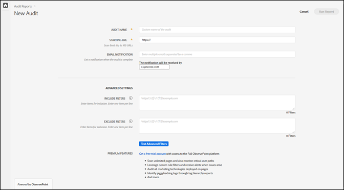

# Create a new audit{#create-a-new-audit}

>[!NOTE]
>
>Users are limited to one audit running at a time. An error occurs if you try to start an audit with the same settings as the one that's running. You can use the link in the error message if you want to cancel the currently running audit so you can create a new one.

If desired, use the link on the bottom of the page to access a free, full-featured trial account with ObservePoint. 

1. From the Auditor list, click **[!UICONTROL New Audit]**.

   The [!DNL New Audit] screen opens.

   

1. (Required) Name the audit.

   The name can be up to 250 characters long. 
1. (Required) Specify the starting URL.

   The protocol is required when specifying the starting URL. The starting URL is the page where the audit begins crawling. Once started, Auditor crawls up to 500 pages, following links that begin at the starting URL. See [Include and Exclude Filters](../create-audit/filters.md#concept-23531490bb124981ba807ed1806e3257) for more information. The starting URL can be up to 250 characters long.

   >[!NOTE]
   >
   >In some cases, it might take up to 48 hours to complete a 500-page scan.

1. Specify one or more email addresses for notifications about this audit.

   You can specify multiple emails by separating each address with a comma. The requestor is notified by default. Email addresses are validated in real time. If you enter an invalid address, your are notified on the screen.

   Each email is limited to no more than 250 characters, including the domain ending (for example, .com). 
1. Specify Include Filters.

   This field can contain exact URLs, partial URLs, or regular expressions. Use this field for criteria you want every URL to match. Any crawled URLs that do not match the Include Filter criteria are not included in the audit results.

   You could enter directories you want the audit to scan. Or, you can perform cross-domain or self-referral auditing, where you need to start the audit on one domain and end on another. To do this, type in the domains you want to traverse; for complex URL patterns, use a regular expression.

   >[!NOTE]
   >
   >If you include a page in your filters, but it's not connected to your starting URL, or Auditor scans 500 pages before reaching that page, the page won't be scanned and won't be included in the test results.

   The include filters are limited to 1,000 characters per line.

   See [Include List](../create-audit/filters.md#section-7626060a56a24b658f8c05f031ac3f5f) for more information. 
1. Specify Exclude Filters.

   The Exclude List prevents URLs from being audited. Use exact URLs, partial URLs, or regular expressions, just as you would in the Include List.

   One common practice is to exclude a logout link if the audit has a user session (for example: `/logout`, meaning any URL containing the string `/logout`).

   The exclude filters are limited to 1,000 characters per line.

   See [Exclude List](../create-audit/filters.md#section-00aa5e10c878473b91ba0844bebe7ca9) for more information. 
1. (Optional) If desired, you can test the include and exclude filters, and test your URLs.

   Enter the filters and URLs, then click **[!UICONTROL Apply]** to run the test.

   

1. Click **[!UICONTROL Run Report]**.
