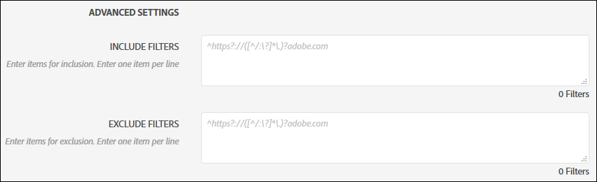
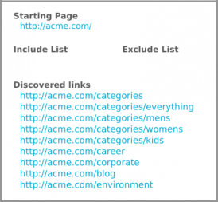
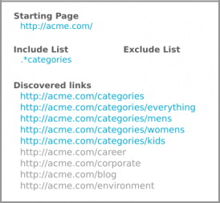
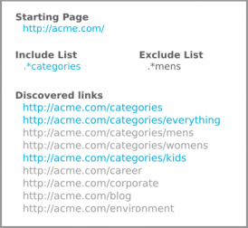
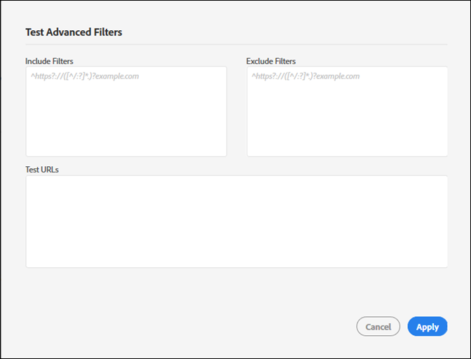

# Include and Exclude filters{#include-and-exclude-filters}

Include filters restrict what links an audit can crawl from the Starting URL. Exclude filters prevent an audit from crawling links.

<!--
Content from ObservePoint (https://help.observepoint.com/articles/2872121-include-and-exclude-filters) with their permission. Modified slightly for style and Auditor emphasis.
-->

Include filters and Exclude filters provide guidelines for audits. By leaving the Include and Exclude filters empty, an audit can crawl any links it comes across, beginning with links on the Starting URL.



By applying Include filters, Exclude filters, or a combination of both, instructions regarding what links an audit can crawl are able to be given.

Any item in the Include Filters field restricts the scan to only the pages that match that item. Any item in an Exclude Filters field prevents any pages that match that item from being scanned.

The Include and Exclude filters can be full URLs, partial URLs, or regular expressions that match a valid page.

## Order of precedence {#section-e9d42419dd3f459bb20e7a33c6104f12}

1. **Starting URL** takes precedence over everything else and will always be visited during an audit, even if a URL matches an item in the Exclude filters. The Starting URL is always visited before any other URLs.

   

   In the image above, an audit discovers links from the starting page's `document.links` property. These links are eligible to be scanned by the audit. 

1. **Include URLs** must be linked from a starting page, otherwise they cannot be discovered and won't be visited.

   

   In the image above, adding an Include filter restricts the eligible URLs to those that match the filter. Now only five links are eligible to be scanned by the audit. 

1. **Exclude URLs** eliminate links from eligibility.

   

   In the image above, adding an Exclude filter prevents URLs from the eligible links. Now only three links are eligible to be scanned by the audit.

## Starting URL {#section-ccb46abcd96f4a8ab171245015d2b724}

Auditor requires a single page for the Starting URL. The Starting URL is always visited before any other URLs. Any links discovered from the starting page are eligible to be visited, subject to the Include and Exclude filters. If an Exclude item matches a Starting URL, it will be ignored.

## Include filters {#section-7626060a56a24b658f8c05f031ac3f5f}

The Include filters limit what links are eligible to be scanned during an audit. Include filters can be:

* Fully qualified URLs 
* Partial URL 
* Regular expressions matching full or partial URLs 
* Any combination of the above

Adding URLs or regular expressions to the Include filter does not guarantee that those specific URLs will be scanned in the audit. The audit inspects the links on the Starting URL, then navigates through the eligible links. The audit continues this process of inspecting and navigating until the limit of 500 scanned URLs is reached or until no more eligible links are found.

>[!NOTE]
>
>In some cases, it might take up to 48 hours to complete a 500-page scan.

By default, an audit will scan all subdomains of the starting URL. Unless explicitly overridden by providing an include filter, the scan will use the following regex include filter:

`^https?://([^/:\?]*\.)?mysite.com`

This makes any link found on the Starting URL page eligible for visiting. It matches any page on any subdomain from the Starting URL.

Using the default Include filter provides a broad range for an audit to crawl. To home in on certain sections or pages, provide specific directions to your audit by adding filters in this box. In that case, replace the default value with the directories that you want the audit to scan. You can also use include filters to perform cross-domain auditing where you need to start the audit on one domain and end on another. To do this, type in the domains you want to traverse. In any case, for any Include Filter URLs to be found, they must be discovered on a page that is audited.

The Include Filters can contain exact URLs, partial URLs, or regular expressions. For example, if the Starting URL is [!DNL http://mysite.com], the following pages would be eligible to be scanned by default (note the bold characters):

```
http://mysite.com
http
<b>s</b>://mysite.com
http://
<b>www</b>.mysite.com/home
http://
<b>dev</b>.mysite.com/home
http://
<b>my</b>.mysite.com/products/products_and_services.html
```

For complex URL patterns, use [ObservePoint's regular expression tester](http://regex.observepoint.com/).

Also refer to the [Common Regular Expressions for ObservePoint](https://help.observepoint.com/articles/2872116-common-regular-expressions-for-observepoint) document for common pattern matching use cases.

## Exclude filters {#section-00aa5e10c878473b91ba0844bebe7ca9}

The Exclude filters prevent URLs from being audited. You can use exact URLs, partial URLs, or regular expressions. Any URL that matches an item in the Exclude filters is not visited. If your Starting URL is included in the Exclude filters, it is not excluded. The Starting URL is always scanned by an audit.

## Testing filters and URLs {#section-3cfa125b1756411395a64701e128efa0}

You can test your filters and URLs within Auditor.

While creating your audit, click **[!UICONTROL Test Advanced Filters]**. Enter your filters and URLs, then click **[!UICONTROL Apply]**.



## ObservePoint documentation {#section-79cdc8e850d047969b6d2badf6bbd6f9}

This article was developed in cooperation with ObservePoint. For the latest information, refer to the [ObservePoint documentation](https://help.observepoint.com/articles/2872121-include-and-exclude-filters). 
