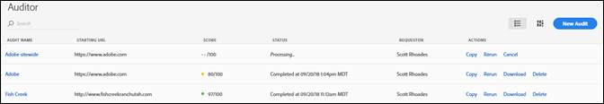
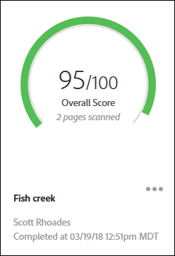
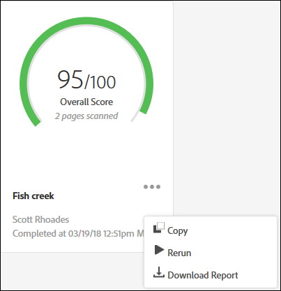

# Audit List page{#audit-list-page}

The Audit List page shows information about all of your audits.

When you start Auditor, the Audit List page appears. You can view the Audit List page as either a list or a card view.

## List view {#section-a428749d2ab94a08bf460e6a486b844a}

List view displays the following information for each of your audits.

* Audit name 
* Starting URL

  The URL where the audit begins crawling your pages. 
* Score

  Audits are scored from 1 to 100, with 100 meaning there are no issues on the scanned pages. 
* Status

  Shows when the audit was completed, or that it is being processed. 
* Requestor

  Shows the name of the user who created the audit. 
* Actions

  Provides links for copying or rerunning the audit, canceling an audit that is currently running, downloading a report as an Excel spreadsheet, or deleting the audit.

Click the name of the audit to see the audit results.

## Card view {#section-6826b585e53a46daa722b9bd3eda926e}

Card view shows each audit in a graphical format.

Click the name of the audit to see the audit results. Click the menu next to the name to see links for copying, rerunning, or canceling the audit, or to download a finished report as an Excel spreadsheet or PDF :

