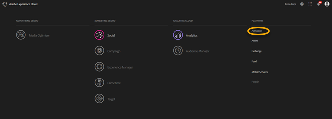
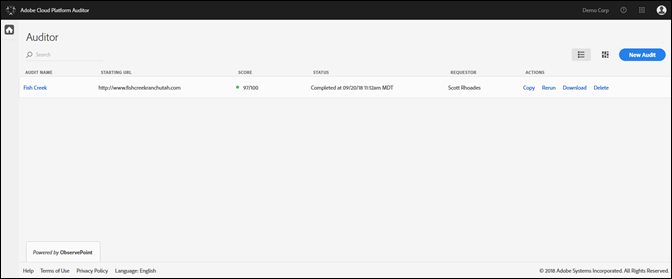
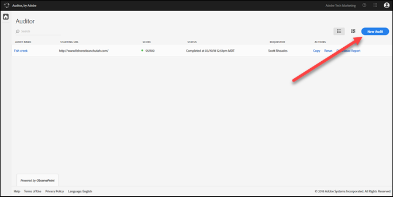
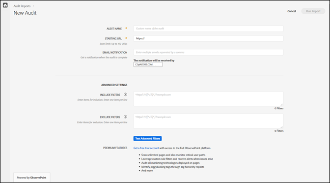
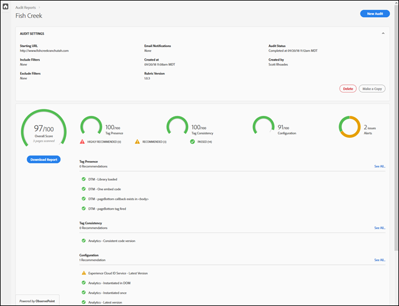

# Getting started{#getting-started}

## Getting started {#task-1024e94b5948413295c9698e62165a04}

<!--
This page is a placeholder for now, we need things like prerequisites, any planning that should be done before using Auditor, initial setup info--that kind of thing.
-->

The first time you use Auditor, you must complete and accept the Auditor agreement. Auditor has been developed as a cooperative effort between Adobe and ObservePoint. Auditor users may use limited ObservePoint functionality for no additional cost. To use Auditor, you must opt-in to communications from ObservePoint. 

## Running your first scan {#task-b211597afed343cfa238443fcf7c6041}

Task Context 

1. Click on the menu button in the top right corner of the Adobe Experience Cloud navigation bar and click **[!UICONTROL Activation]**.

   

1. Select Auditor and accept the Terms of Use.

   The Auditor page gives you a dashboard of previous scans, along with the option of running a new scan.

   

1. Click **[!UICONTROL New Audit]**.

   To run a new scan, click **[!UICONTROL New Audit]** in the top right hand corner of the screen.

   

1. Configure scan.

   Name the audit, provide a starting URL, and click **[!UICONTROL Run Report]**. After your scan is complete, you’ll receive an email notification.

   

   For a description of all the configuration options, see [Create a New Audit](../create-audit/create-new-audit.md#task-6d157f80e5264642b877c2820b1d077d). 
1. View your report.

   When you receive the email letting you know the scan is complete, click on the link to [view your report](../reports/scorecard.md#concept-8958a64346c34f74844553dda1ccf869) and start understanding opportunities to improve your implementation and gain more value from your Adobe solutions.

   You can also click the name of the audit in the [Auditor page](../get-started/audit-list.md) to see the status of the audit and to view the report after the audit is complete.

   
