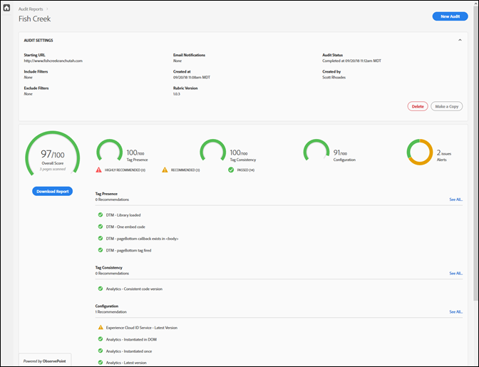
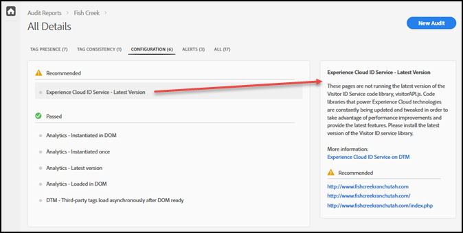

# Scorecard{#scorecard}

After you run a test, the scorecard shows information about an audit.

Click the name of your audit on the Auditor page to view the results of your test.

Use the scorecard to see how the audit scored in the following categories:

* Overall score 
* Tag presence

  Evaluates whether the tag exists, and whether it's in the right place in your page code. 
* Tag consistency

  Evaluates whether the tags are consistent across URLs. 
* Configuration

  Evaluates the tags against other rules and recommended best practices. 
* Alert

  Alerts show issues you should be aware of, but that don't affect your score.

Your score depends on the weight of each test and whether you pass or fail. If you pass, your score increases by the number of points equal to the test weight.

* 0: Alerts you of issues you should be aware of, but that don't affect your score. 
* 1: Recommends an optimization. No impact on data accuracy. 
* 2: Failing this test means you won't have access to the latest features and fixes in the Adobe Experience Cloud. 
* 3: Tests for efficiency and whether the implementation adheres to highly recommended best practices. 
* 4: Failure means you may be collecting unreliable data. 
* 5: Failure means you may see data loss.

The scorecard lists any level 4 or 5 issues as **highly recommended** that you fix.

The scorecard lists any level 1 to 3 issues as **recommended** that you fix.

Click **[!UICONTROL Download the Report]** to download either an Excel or PDF file containing the information reported by the audit.

In addition to the score for each category, the scorecard lists any fixes that are recommended or highly recommended, as well as the items that passed the test. Click on each issue to see additional details in the box on the right. Click again to drill down further and see recommendations of how to fix the issue. The following shows the details for a Recommended issue in the scorecard shown above:

Click the categories across the top of the screen to see the issues found in each category.

## Which pages were part of the test? {#section-fd38ffeb868648e89c34c5772fa65f46}

You can view lists of the URLS that passed or failed your test.

From the Scorecard, click a test name or the **[!UICONTROL See All]** link under each category heading. This takes you to the details of the tests. For each test, you can see the test description and a list of any urls that failed and passed. This information is also included in downloaded reports. 
