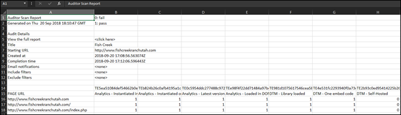

# Download report{#download-report}

The report shows whether each URL passes or fails.

The report can be viewed on the Scorecard page in the user interface. You can also download the report: 

1. From the Auditor list or a scorecard, click **[!UICONTROL Download Report]**.

   You can download the report as a spreadsheet or PDF file. 
1. Specify whether to open or save your file.

   Step Result 1. Click **[!UICONTROL OK]**.

   Step Result The spreadsheet shows whether each test passed or failed on each of your pages. 
>
>>
>The PDF shows the following information: 
>
>* Settings for the audit 
>* Completion timestamp 
>* Overall score 
>* Score per category 
>* Unit tests applied with URLs that failed 
>* Recommendations and Help doc link per test 
>

